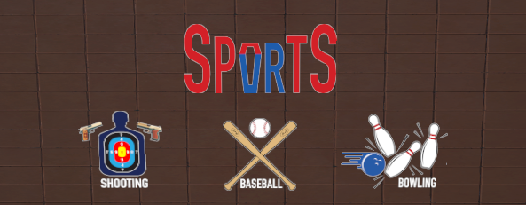
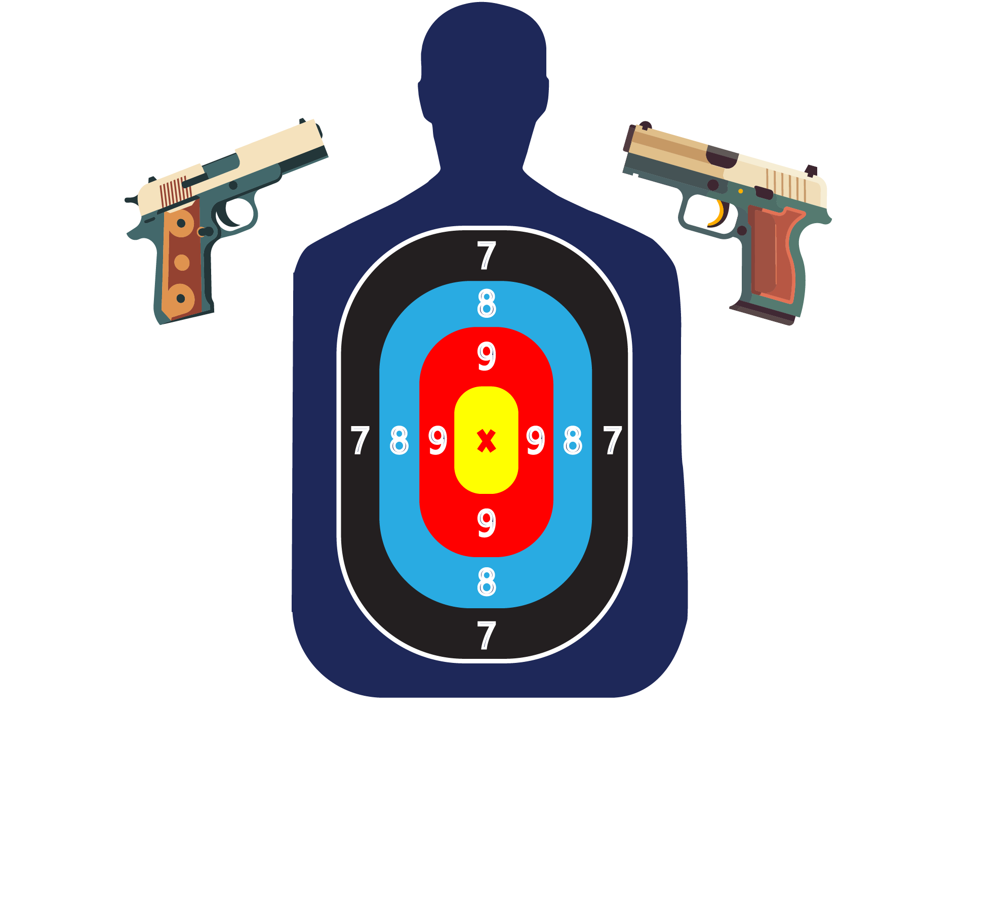
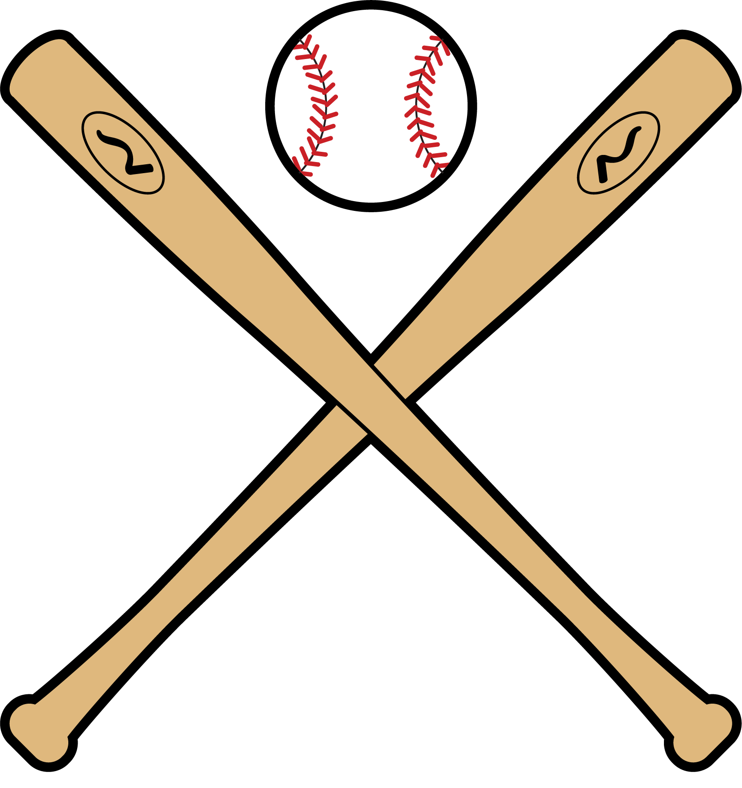
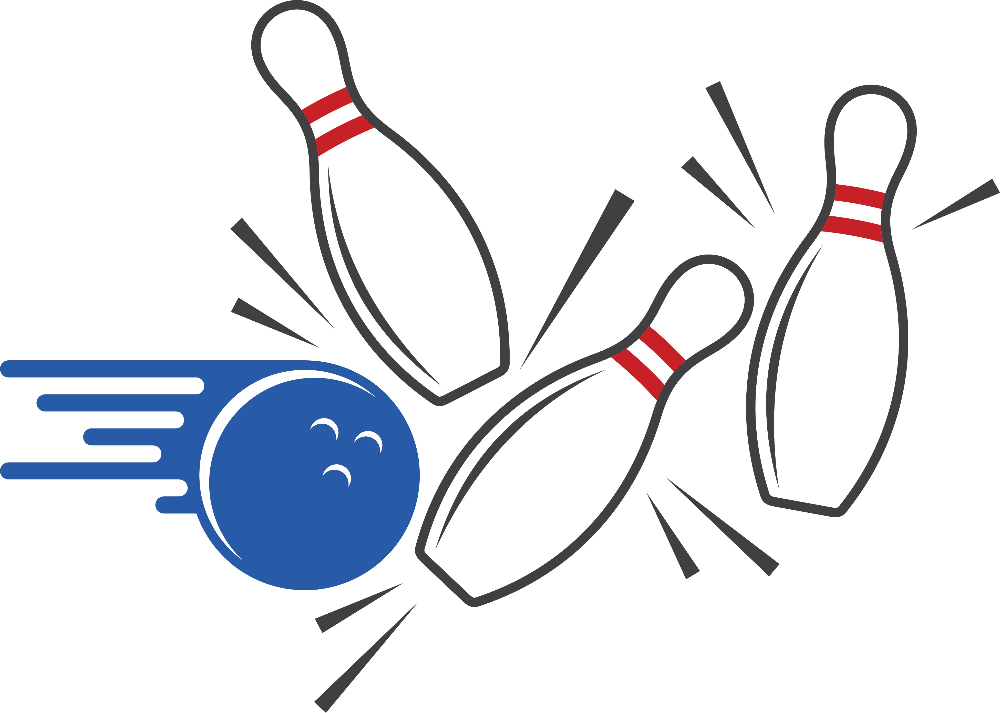

# VR-Sport-Project
Unity-Based VR Games inspired by Wii Sport for Modul VR-AR WS 2023/2024 FH Aachen

**created by:**
Alexander Matthew
Fachrial Dimas Putra Perdana

**Assets lists:**
1. POLYGON ([https://assetstore.unity.com/publishers/5217](https://assetstore.unity.com/packages/3d/environments/polygon-sampler-pack-207048))
2. Baseball Bats - Pack (https://assetstore.unity.com/packages/3d/props/weapons/baseball-bats-pack-102171)
3. Locker Room Props (https://assetstore.unity.com/packages/3d/props/interior/locker-room-props-3355)
4. Simple Garage (https://assetstore.unity.com/packages/3d/props/interior/simple-garage-197251)
5. Morgue Room PBR (https://assetstore.unity.com/packages/3d/environments/morgue-room-pbr-65817#content)

**Unity Packages:**
1. XR Interaction Toolkit 2.0.4 (https://docs.unity3d.com/Packages/com.unity.xr.interaction.toolkit@2.5/manual/index.html)
2. XR Plugin Management 4.4.0 (https://docs.unity3d.com/Manual/com.unity.xr.management.html)
3. Open XR Plugin 1.4.2 (https://docs.unity3d.com/Packages/com.unity.xr.openxr@1.8/manual/index.html)
Note: if you have OpenVR XR installed please deactivate it, in Edit > Project Settings > XR Plug-in Management > uncheck OpenVR XR

# **Controller instructions:**
- To Grab or Interact with interactables press the grip button of the controller (hold the grip button to keep holding the grabbables)
- In the shooting games, press the trigger button to shoot while holding the gun with the grip button
- To open the volume setting press the menu button and then adjust the slider and close the setting with the trigger button
- To move use the Trackpad or analog of the left controller
- To turn use the Trackpad or analog of the right controller

# **About the Games**

Upon opening you will be landed on Lobby

Audio volume is customizable by pressing the menu button of the controller

you can choose between one of the 3 mini games:
1. Shooting

3. Baseball

4. Bowling

After choosing and confirming, you will be landed the scene of your choice and will be presented with a tutorial (only can be viewed when you get in to the scene)

- To quit the scene interact with the door on each scene and confirm

- To quit the game interact with the door in the lobby and confirm

# **Videos**
- Shooting
  
- Baseball
  
- Bowling
  
- Lobby
  

